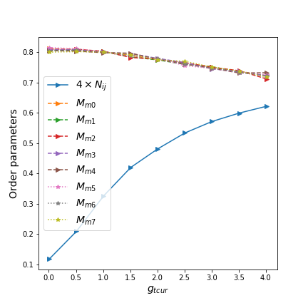

> First trial with jupyter notebook.

# Mean field solution on spin-1/2 bond-bond interaction Hamiltonian

Outline:
- HS decomposition; Mean-field approximation;
- Define the order parameter
- Programming it.

## Mean field approach in lattice space
First, the triplet current order in the mean field approximation is

_{\sigma\sigma'}c_{j\sigma'}-H.c.\rangle)

The restricted mean-field staggered spin flux order parameter N is defined as

^{i_x+i_y}(\delta_{j-i,\hat%10x}-\delta_{j-i,\hat%10y})\hat%10z\tag1)

This represents a flux phase. This phase breaks the parity, translation by one site and conjugation symmetry.
### 1. Order parameter against interaction strength

### 2. Order parameter against doping strength

---
The order parameter M is defined in the way,

and for the mean field order parameter, I chose

\tag2)

but it doesn't work well in the simulation. So I digged some old papers which discussed the similar model.

In Ref. 3, the SU(n) Hubbard-Heisenberg model can be restored to our SU(2) model when n=2, and the ground state is constructed out by the valence bonds. The normal site-centered charge density wave becomes the bond-centered density wave. However, the nearest neighber state is formed under the condition that n is approching infinity. Those processes that create non-nearest-neighbor bonds have amplitudes which are of order 1/n. The singlet bond operators also correspond to a bond-centered spin-density wave(the Heisenberg exchange term),

maybe the order parameter in mean-field calculation should be defined on each bond,

\tag3)

and the new unit cell consists of the four sites at the corners of a square in the origin lattice.
## Useful advices:

- [你为什么使用 jupyter ，进行分析，而不是用 python 脚本或仅仅利用 excel ？](https://www.zhihu.com/question/37490497)
- [Git基本操作](http://www.runoob.com/git/git-basic-operations.html)
- [Emacs: Python最好的编译器？](https://segmentfault.com/a/1190000004165173)
